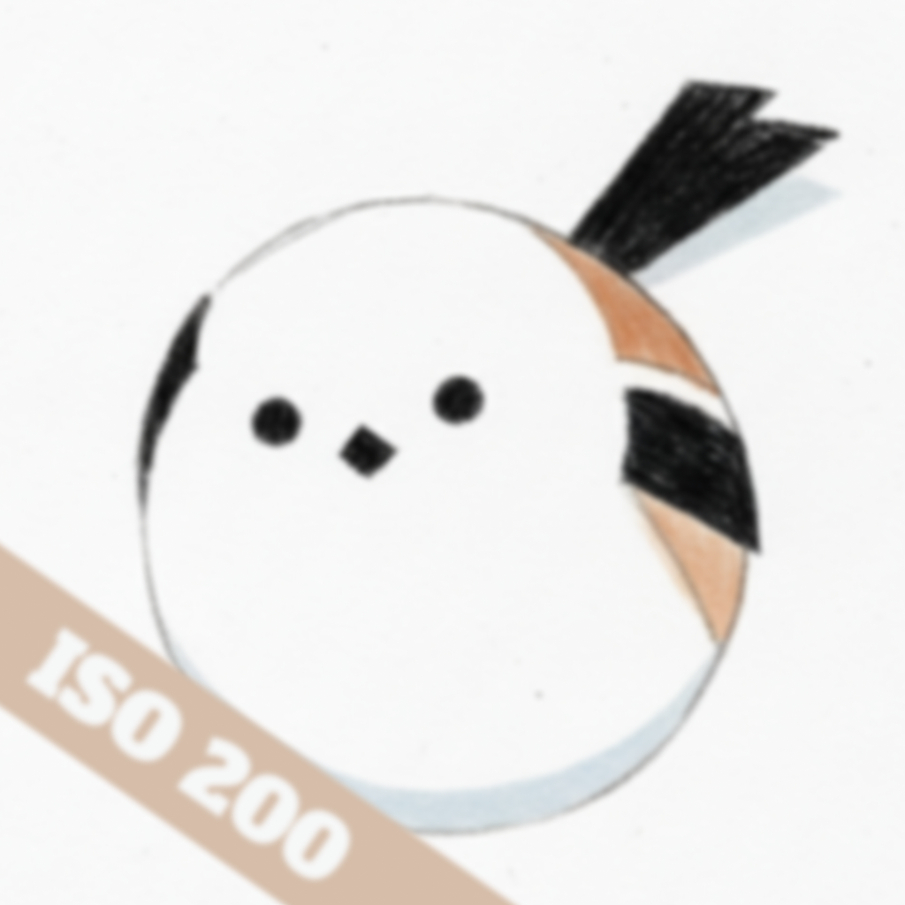

 
<h1>M43x2</h1>

<h2>About M43x2</h2>

An open-source mobile app dedicated to the Micro Four Thirds (M43) community and Olympus/OM System lovers. Built with React Native, this project is both a tool for photographers and a playground for me to practice modern mobile development.

<h2>Open Source & Contribute</h2>

This project is open-source. Whether you are a developer looking to improve the code or a photographer with a great "color recipe," your contributions are welcome!

---
"Small sensor, big heart. Get home before dark." Built with ❤️ by a M43 fan.

